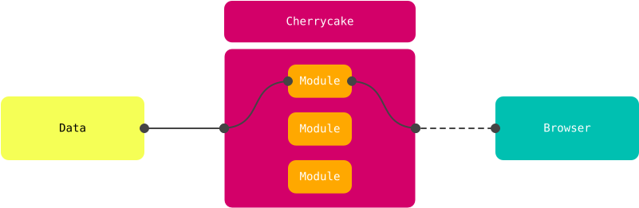

# Architecture

At its simplest, Cherrycake can be understood primarily as an HTTP request router. That is, the mechanism that receives HTTP requests, hands them over to the proper module for processing, and then hands over whatever resulted from the processing to whoever did the request in the first place.

By definition, an HTTP request router like Cherrycake stands somewhere in the middle of the client-server chain. 

Without the oversimplification of the diagram above, a more accurate representation of the overall architecture of a simple application running Cherrycake looks like this:

But if we scratch the surface a little bit, it looks more like this:

