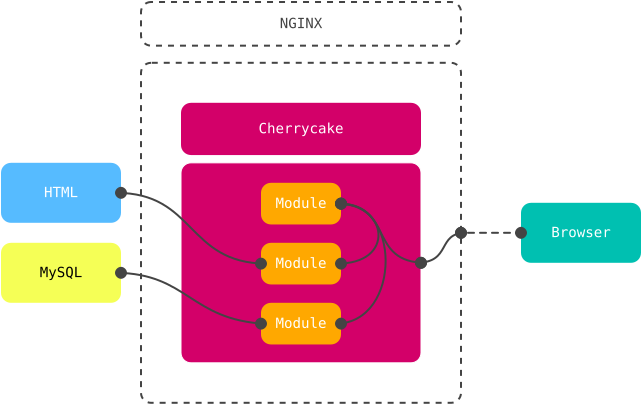

# Basics

At its simplest, Cherrycake can be understood primarily as request router. That is, the mechanism that receives requests, hands them over to the proper module for processing, and then hands over whatever resulted from the processing to whoever did the request in the first place.

Cherrycake runs as a PHP application typically behind an HTTP server like NGINX, receiving all relevant requests and connecting with any third party sources like MySQL or Redis when needed.

> Cherrycake apps can also run as [command line apps](../guide/cli.md).

Without some of the oversimplification of the diagram above, a more accurate representation of the overall architecture of a simple application running Cherrycake looks like this:

