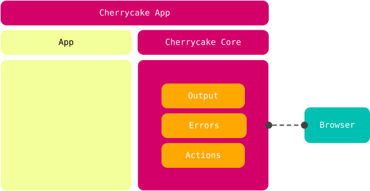
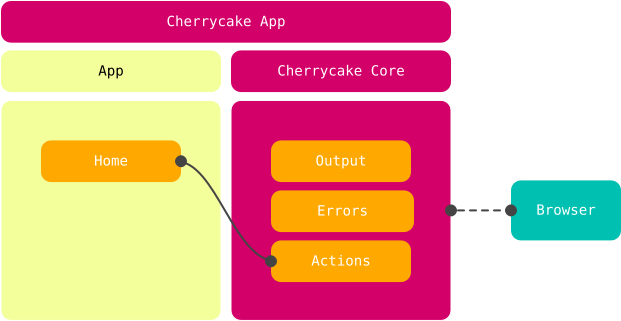
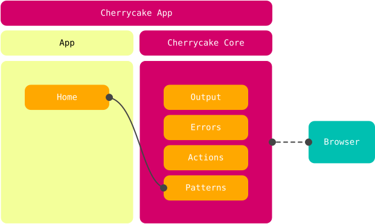
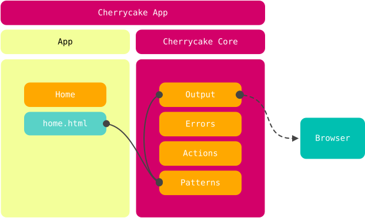

# Lifecycle

We'll first go through a simplified version of the lifecycle of a request, assuming we're building a website application and our client is a web browser.

When a Cherrycake application receives a request, it first loads some initial modules like [Output](../../reference/core-modules/output.md), [Errors](../../reference/core-modules/errors.md) and [Actions](../../reference/core-modules/actions.md). These are the modules that Cherrycake needs to determine what to do next:

Cherrycake now asks the [Actions]() module to attend the received request:

To do so, [Actions]() checks the requested route to see which modules have mapped an action. If it founds a  mapped action that matches the current request, loads and runs the module who mapped it.

Let's say the browser requested the home of our website by requesting the `/` route, and that this route has been mapped by a module we called _Home_. Cherrycake loads this module and runs it:

_Home_ is an app module \(as opposed to a core module\), and is in charge of showing the home page of the website. To do so, _Home_ uses the [Patterns](../../reference/core-modules/patterns.md) core module to load an HTML file from disk and then send it to the browser. Since the Patterns module has not been loaded yet, Cherrycake loads it automatically:

Since all output is handled by the [Output](../../reference/core-modules/output.md) core module, [Patterns](../../reference/core-modules/patterns.md) reads the requested HTML file and uses [Output](../../reference/core-modules/output.md) to send back the response to the Browser, and the request lifecycle concludes.

Now let's take a deeper look at how all this happens with some code, in the [Deep lifecycle](deep-lifecycle.md) section.

