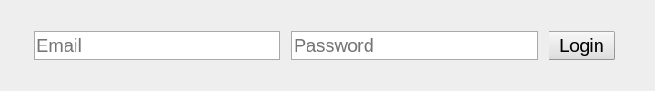

# Creating a login form

The [Login](../../reference/core-modules/login/) module provides the logic for a user authentication mechanism, but it's up to you to build a form to ask the user for his credentials, or to implement any kind of interface for a user to authenticate in your web app.

We'll analyze step by step the example provided in the [Cherrycake documentation examples](https://github.com/tin-cat/cherrycake-documentation-examples) repository, in the module called `LoginGuide`.

First we'll create our module in `/modules/LoguinGuide/LoginGuide.class.php`:

```php
<?php

namespace CherrycakeApp;

class LoginGuide extends \Cherrycake\Module {
    protected $dependentCoreModules = [
        "HtmlDocument",
        "Login"
    ];
}
```

> See how we've already added the [HtmlDocument](../../reference/core-modules/htmldocument/) and [Login](../../reference/core-modules/login/) dependencies.

Now we'll [define an action](../actions-guide/) that will show a welcome page when the user visits the `/login-guide` URL:

```php
<?php

namespace CherrycakeApp;

class LoginGuide extends \Cherrycake\Module {
    protected $dependentCoreModules = [
        "HtmlDocument",
        "Login"
    ];
    
    public static function mapActions() {
        global $e; 
        $e->Actions->mapAction(
            "loginGuideHome",
            new \Cherrycake\ActionHtml([
                "moduleType" => \Cherrycake\ACTION_MODULE_TYPE_APP,
                "moduleName" => "LoginGuide",
                "methodName" => "home",
                "request" => new \Cherrycake\Request([
                    "pathComponents" => [
                        new \Cherrycake\RequestPathComponent([
                            "type" => \Cherrycake\REQUEST_PATH_COMPONENT_TYPE_FIXED,
                            "string" => "login-guide"
                        ])
                    ]
                ])
            ])
        );
    }
    
    function home() {
        global $e;
    
        $e->Output->setResponse(new \Cherrycake\ResponseTextHtml([
            "code" => \Cherrycake\RESPONSE_OK,
            "payload" =>
                $e->HtmlDocument->header().
                ($e->Login->isLogged() ?
                    "You are logged in"
                :
                    "You are not logged in"
                ).
                $e->HtmlDocument->footer()
        ]));
    }
}
```

Notice that the page shows the message `You are logged in` or `You are not logged in`. To determine whether the current user is logged in, we use the [Login::isLogged](../../reference/core-modules/login/login-methods.md#islogged) method.

Now we'll add another action that will show a login form in the `/login-guide/login-page` URL:

```php
$e->Actions->mapAction(
    "loginGuideLoginPage",
    new \Cherrycake\ActionHtml([
        "moduleType" => \Cherrycake\ACTION_MODULE_TYPE_APP,
        "moduleName" => "LoginGuide",
        "methodName" => "loginPage",
        "request" => new \Cherrycake\Request([
            "pathComponents" => [
                new \Cherrycake\RequestPathComponent([
                    "type" => \Cherrycake\REQUEST_PATH_COMPONENT_TYPE_FIXED,
                    "string" => "login-guide"
                ]),
                new \Cherrycake\RequestPathComponent([
                    "type" => \Cherrycake\REQUEST_PATH_COMPONENT_TYPE_FIXED,
                    "string" => "login-page"
                ])
            ]
        ])
    ])
);
```

```php
function home() {
    global $e;

    $e->Output->setResponse(new \Cherrycake\ResponseTextHtml([
        "code" => \Cherrycake\RESPONSE_OK,
        "payload" =>
            $e->HtmlDocument->header().
            "
                <form method=post>
                    <input name=email type=text name=email placeholder=\"Email\" />
                    <input name=password type=password name=password placeholder=\"Password\" />
                    <input type=submit value=\"Login\"/>
                </form>
            ".
            $e->HtmlDocument->footer()
    ]));
}
```

And we'll add a button right next to the `You are not logged in` message, that will link to this login page:

```php
function home() {
    global $e;

    $e->Output->setResponse(new \Cherrycake\ResponseTextHtml([
        "code" => \Cherrycake\RESPONSE_OK,
        "payload" =>
            $e->HtmlDocument->header().
            ($e->Login->isLogged() ?
                "You are logged in"
            :
                "You are not logged in".
                "<a href=\"{$e->Actions->getAction("loginGuideLoginPage")->request->buildUrl()}\" class=button>Login</a>"
            ).
            $e->HtmlDocument->footer()
    ]));
}
```

See how, instead of linking directly to `/login-guide/login-page`, we've used the [Actions::getAction](../../reference/core-modules/actions-1/actions.md#getaction) and the [Request::buildUrl](../../reference/core-classes/request/request-methods.md#buildurl) methods in chain to obtain the URL for the action that triggers the login page, as you've learned in the [Actions guide](../actions-guide/getting-the-url-of-an-action.md).

So now, when we access the /login-guide page, this appears:


And when we click the Login button, the `/login-guide/login-page` appears:



> Clicking the `Login` button does nothing because we haven't yet set the `action` property of the form HTML element.

Now let's create an action that will be triggered when the `Login` button is clicked. This action will use the Login module to check the received `email` and `password`, and act accordingly afterwards.

We'll call this action `loginGuideDoLogin`:

```php
$e->Actions->mapAction(
    "loginGuideDoLogin",
    new \Cherrycake\ActionHtml([
        "moduleType" => \Cherrycake\ACTION_MODULE_TYPE_APP,
        "moduleName" => "LoginGuide",
        "methodName" => "doLogin",
        "request" => new \Cherrycake\Request([
            "isSecurityCsrf" => true,
            "pathComponents" => [
                new \Cherrycake\RequestPathComponent([
                    "type" => \Cherrycake\REQUEST_PATH_COMPONENT_TYPE_FIXED,
                    "string" => "login-guide"
                ]),
                new \Cherrycake\RequestPathComponent([
                    "type" => \Cherrycake\REQUEST_PATH_COMPONENT_TYPE_FIXED,
                    "string" => "do-login"
                ])
            ]
        ]),
        "isSensibleToBruteForceAttacks" => true
    ])
);
```

> We've set the [`isSensibleToBruteForceAttacks`](../../reference/core-classes/action/methods.md#__construct) parameter to true when creating the [Action](../../reference/core-classes/action/) to improve the resistance of this request to brute force attacks. We've also set the [`isSecurityCsrf`](../../reference/core-classes/request/request-methods.md#__construct) parameter to true when creating the [Request](../../reference/core-classes/request/), which adds protection against Cross-Site Request Forgery-type attacks to this request.

And here's how the `doLogin` method looks:

```php
function doLogin($request) {
    global $e;
    $result = $e->Login->doLogin($request->email, $request->password);
    if (
        $result == \Cherrycake\LOGIN_RESULT_FAILED_UNKNOWN_USER
        ||
        $result == \Cherrycake\LOGIN_RESULT_FAILED_WRONG_PASSWORD
    ) {
        $e->Output->setResponse(new \Cherrycake\ResponseTextHtml([
            "code" => \Cherrycake\RESPONSE_OK,
            "payload" => $e->HtmlDocument->header()."Login error".$e->HtmlDocument->footer()
        ]));
    }
    else {
        $e->Output->setResponse(new \Cherrycake\Response([
            "code" => \Cherrycake\RESPONSE_REDIRECT_FOUND,
            "url" => $e->Actions->getAction("loginGuideHome")->request->buildUrl()
        ]));
    }
}
```

Note we've used the [Login::doLogin](../../reference/core-modules/login/login-methods.md#dologin) method to check the passed email and password. If the login failed, we show a simple error page. If it was successful, we redirect the user to the login home using [Output::setResponse](../../reference/core-modules/output/methods.md#setresponse) with a [RESPONSE\_REDIRECT\_FOUND](../../reference/core-modules/output/#constants) code.

